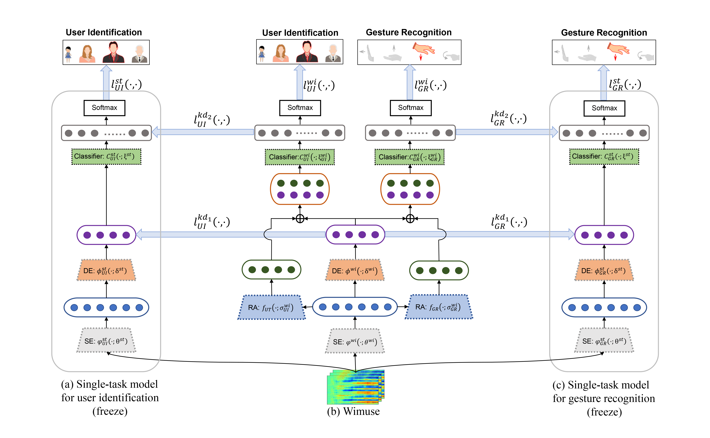

# WiFi-based Multi-task Sensing

## Introduction

WiFi-based sensing has aroused immense attention as numerous studies have made significant advances over recent years. The rationale is that the signal fluctuations caused by humans carry the information of human behavior which can be extracted from the physical layer feature (i.e., channel state information) of WiFi. Still, the prior studies mainly focus on single-task sensing (i.e., human gesture recognition, indoor localization, user identification, etc.). Based on the observation that the signal fluctuations caused by human gestures are highly coupling with body features and locations, we propose a WiFi-based multi-task sensing model (Wimuse) to perform gesture recognition, user identification, and indoor localization simultaneously. However, these tasks have different difficulty levels (i.e., imbalance issue) and need task-specific information (i.e., discrepancy issue). To address these issues, the knowledge distillation technique and task-specific re-sidual adaptor are adopted in Wimuse. We first train the single-task sensing (STS) model for each task. Then, for solving the imbalance issue, the extracted common feature in Wimuse is encouraged to get close to the counterpart features of the STS models under the Euclidean distance. Further, for each task, a task-specific residual adaptor is applied to extract the task-specific compensation feature which is fused with the common feature to address the discrepancy issue. We conduct comprehensive experiments on three public datasets and evaluation suggests that Wimuse achieves state-of-art performance with the average accuracy of 85.20%, 98.39%, and 98.725% on the joint task of gesture recognition, in-door localization, and user identification task respectively.

### Wimuse architecture

## Training and Testing

### Install dependencies

* This code has been tested on Ubuntu 16.04 with Python 3.6 and PyTorch-1.8.0.
* Install [PyTorch and torchvision](http://pytorch.org/).
* Install (pytorch-lightning)[https://github.com/PyTorchLightning/pytorch-lightning]

### Download the datasets

* Download Widar3.0 dataset: http://tns.thss.tsinghua.edu.cn/widar3.0/
* Download ARIL dataset: https://github.com/geekfeiw/ARIL
* Download CSIDA dataset: https://pan.baidu.com/s/1Teb8hVWDxhOw0aIoVnS7Qw Password:lwp6 

### Train and Test the model

* Run `python run.py`. This will train and test all the models and place the results into `lightning_logs` (this folder will be automatic constructed).

